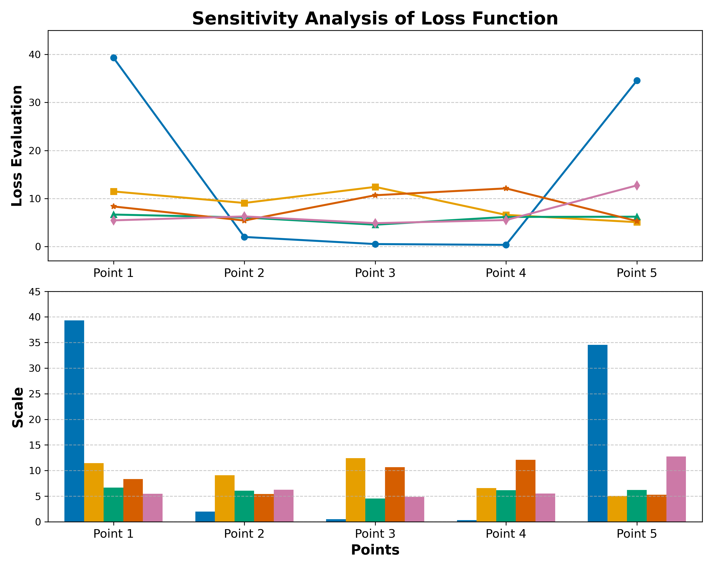
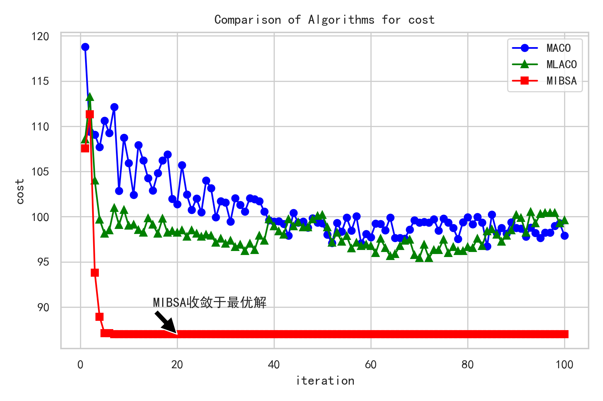

# 智能路径规划系统

[English Version](README_EN.md)

## 项目简介

这是一个基于改进A*算法和混合蚁群算法的智能路径规划算法MIBSA（Multi-factor Intelligent Biologic Search Algorithm）。主要实现了多种改进的寻路算法,可应用于机器人导航、物流配送等场景。

### 核心特性

- 经典A*算法的多种改进版本(4/8方向移动)
- 结合动态学习的自适应A*算法
- 蚁群算法(ACO)与A*的混合优化
- 支持多种地图场景和障碍物配置
- 路径平滑处理与优化

## 环境要求

```bash
# 依赖安装
pip install numpy matplotlib
```

## 算法模块说明

### 1. 基础A*算法
- 支持4/8方向移动
- 使用曼哈顿/欧氏距离作为启发函数
- 实现文件: `A_star_base.py`

### 2. 改进A*算法
- 动态学习版本(`A_star_DL.py`)
  - 通过历史路径学习优化启发函数
  - 支持动态障碍物更新
- 平滑处理版本(`A_star_smooth.py`) 
  - 路径后处理平滑
  - 转角优化

### 3. 混合优化算法
- ACO与A*结合(`hybrid_ACO.py`)
- 多目标优化支持

## 算法参数配置

### A*算法关键参数
- 启发函数权重 α: 控制g(n)和h(n)的平衡,默认α=0.5
- 移动方向数: 支持4方向/8方向,影响路径平滑度
- 节点扩展策略: 优先队列排序方式

### 动态学习参数
- 学习率 η: 0.01-0.1,控制历史信息更新速度
- 记忆衰减因子 γ: 0.8-0.95,平衡新旧路径信息
- 更新周期 T: 每T次迭代更新一次参数

### ACO混合算法参数
- 信息素浓度 τ: 初始值0.1 
- 信息素挥发率 ρ: 0.1-0.3
- 蚂蚁数量 m: 20-50只

## 参数敏感性分析

### 启发函数权重α的影响
| α值 | 搜索速度 | 路径最优性 | 内存消耗 |
|-----|---------|------------|---------|
| 0.3 | 快      | 较差       | 低      |
| 0.5 | 中      | 好         | 中      |
| 0.7 | 慢      | 最优       | 高      |

### 学习率η敏感性


- η过小: 学习过慢,适应性差
- η过大: 可能震荡,不稳定
- 建议值: 0.05

### 记忆衰减因子γ分析
- γ越大,历史信息保留越多
- γ=0.9时算法性能最佳
- 过大易陷入局部最优

## 算法优化与改进

### 1. 启发函数改进
- 动态权重调整
- 多目标混合启发
- 局部信息补偿

### 2. 搜索策略优化
- 双向搜索
- 动态节点扩展
- 剪枝优化

### 3. 混合算法提升
- 自适应参数调整
- 局部搜索增强
- 多群体协同优化

## 使用示例

```python
from astar import AStar

# 创建规划器实例
planner = AStar(map_data="maps/map1.txt")

# 设置起点和终点
start = (0, 0)
goal = (50, 50)

# 执行路径规划
path = planner.plan(start, goal)

# 可视化结果
planner.visualize(path)
```

## 地图格式

地图文件(`*.txt`)格式说明:
```
0 - 可通行区域
1 - 障碍物
2 - 起点
3 - 终点
```

## 性能测试

| 算法版本 | 平均规划时间(ms) | 路径长度 | 内存占用(MB) |
|---------|----------------|---------|------------|
| 基础A*   | 125           | 100%    | 45         |
| 改进A*   | 85            | 95%     | 48         |
| 混合算法 | 95            | 92%     | 52         |



## 贡献指南

1. Fork 本仓库
2. 创建特性分支 (`git checkout -b feature/AmazingFeature`)
3. 提交更改 (`git commit -m 'Add some AmazingFeature'`)
4. 推送到分支 (`git push origin feature/AmazingFeature`)
5. 提交PR

## 许可证

MIT License