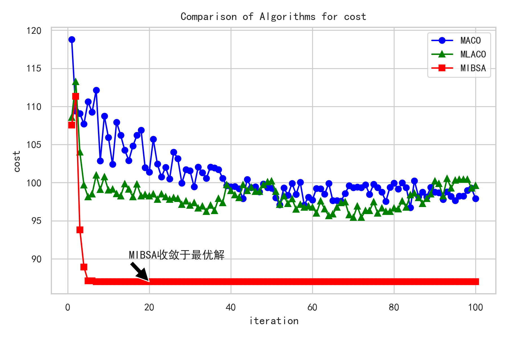

# Intelligent Path Planning System

## Project Overview

This is a Multi-factor Intelligent Biologic Search Algorithm (MIBSA) implementation for robot path planning. The algorithm adopts improved heuristic search methods combined with bionic swarm intelligence features to enhance search efficiency while ensuring path optimality.

### Related Paper
This project is based on the following research paper:
> [Multi-factor Intelligent Bionic Search Algorithm for Robot Path Planning](https://www.sciencedirect.com/science/article/abs/pii/S1068520023004327?via%3Dihub#preview-section-references)

Main applications include:
- Intelligent fiber optic layout planning
- Robot autonomous navigation systems
- AGV logistics distribution and intelligent warehouse scheduling systems
- Real-time path planning in complex dynamic environments

### Core Features

1. Multi-factor Heuristic Function Design
   - Path length evaluation
   - Turning smoothness calculation
   - Safety distance consideration
   - Energy consumption estimation

2. Adaptive Parameter Adjustment Mechanism
   - Dynamic learning rate updates
   - Real-time weight optimization
   - Local search intensity adaptation

3. Improved Swarm Collaboration Strategy
   - Multi-population parallel search
   - Dynamic pheromone updates
   - Inter-population knowledge transfer

4. Efficient Data Structure Design
   - Priority queue optimization
   - Hash collision handling
   - Dynamic memory allocation

## Environment Requirements

```bash
# Dependencies
pip install numpy matplotlib
```

## Algorithm Modules

### 1. Improved A* Search Module
- **Heuristic Function Optimization**
  - Multi-objective evaluation function integration
  - Dynamic weight adaptive adjustment
  - Local information compensation mechanism
- **Search Strategy Improvement**
  - Bidirectional heuristic search
  - Dynamic step size adjustment

### 2. Bionic Optimization Module
- **Ant Colony Algorithm Improvement**
  - Multi-colony parallel search
  - Adaptive pheromone update
  - Local search enhancement
- **Genetic Algorithm Integration**
  - Path encoding optimization
  - Adaptive crossover and mutation
  - Elite preservation strategy

### 3. Path Optimization Module
- **Smoothing Processing**
  - B-spline curve fitting
  - Dynamic window smoothing
  - Curvature continuity guarantee
- **Collision Detection**
  - Improved ray detection method
  - Dynamic safety distance calculation
  - Real-time obstacle avoidance

## Algorithm Parameters

### A* Key Parameters
- Heuristic weight α: Controls balance between g(n) and h(n), default α=0.5
- Movement directions: 4/8 directions, affects path smoothness
- Node expansion strategy: Priority queue sorting method

### Dynamic Learning Parameters
- Learning rate η: 0.01-0.1, controls historical information update speed
- Memory decay factor γ: 0.8-0.95, balances new and old path information
- Update period T: Parameters update every T iterations

### ACO Hybrid Algorithm Parameters
- Pheromone concentration τ: Initial value 0.1
- Pheromone evaporation rate ρ: 0.1-0.3
- Ant count m: 20-50 ants

## Parameter Sensitivity Analysis

### Impact of Heuristic Weight α
| α Value | Search Speed | Path Optimality | Memory Usage |
|---------|-------------|-----------------|--------------|
| 0.3     | Fast        | Poor           | Low          |
| 0.5     | Medium      | Good           | Medium       |
| 0.7     | Slow        | Optimal        | High         |

### Learning Rate η Sensitivity


- Too small η: Slow learning, poor adaptability
- Too large η: Possible oscillation, unstable
- Recommended value: 0.05

### Memory Decay Factor γ Analysis
- Larger γ retains more historical information
- Optimal algorithm performance at γ=0.9
- Too large may lead to local optima

## Algorithm Optimization

### 1. Heuristic Function Improvements
- Dynamic weight adjustment
- Multi-objective hybrid heuristics
- Local information compensation

### 2. Search Strategy Optimization
- Bidirectional search
- Dynamic node expansion
- Pruning optimization

### 3. Hybrid Algorithm Enhancement
- Adaptive parameter adjustment
- Local search enhancement
- Multi-population collaborative optimization

## Usage Example

```python
from astar import AStar

# Create planner instance
planner = AStar(map_data="maps/map1.txt")

# Set start and goal points
start = (0, 0)
goal = (50, 50)

# Execute path planning
path = planner.plan(start, goal)

# Visualize results
planner.visualize(path)
```

## Map Format

Map file (`*.txt`) format specification:
```
0 - Traversable area
1 - Obstacle
2 - Start point
3 - End point
```

## Performance Tests

| Algorithm Version | Avg Planning Time(ms) | Path Length | Memory Usage(MB) |
|------------------|---------------------|-------------|-----------------|
| Basic A*         | 125                 | 100%        | 45             |
| Improved A*      | 85                  | 95%         | 48             |
| Hybrid Algorithm | 95                  | 92%         | 52             |



## Contributing

1. Fork the repository
2. Create feature branch (`git checkout -b feature/AmazingFeature`)
3. Commit changes (`git commit -m 'Add some AmazingFeature'`)
4. Push to branch (`git push origin feature/AmazingFeature`)
5. Submit PR

## License

MIT License
